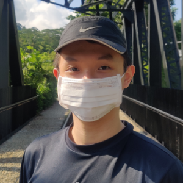
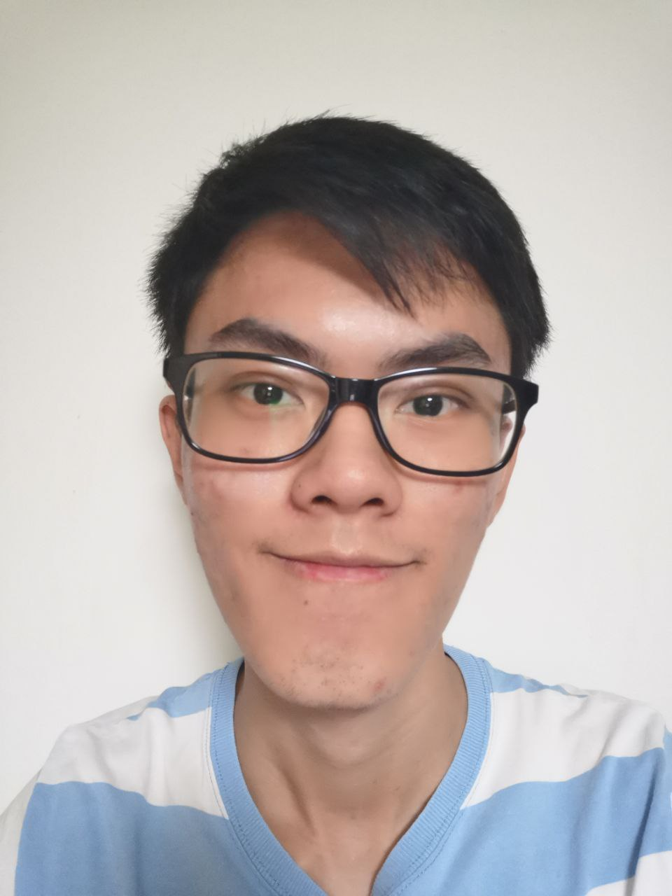
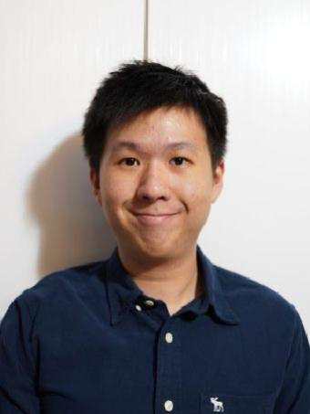
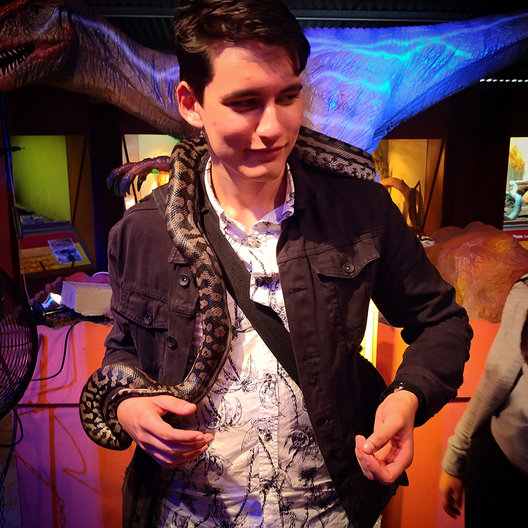

We are a team based in the [School of Computing, National University of Singapore](http://www.comp.nus.edu.sg).

You can reach us at the email `seer[at]comp.nus.edu.sg`

## Project team

### Prof Damith

[[homepage](http://www.comp.nus.edu.sg/~damithch)]
[[github](https://github.com/johndoe)]
[[portfolio](team/johndoe.md)]
* Role: Project Advisor

### Darren Hoon

[[github](https://github.com/darrenhoon)]
[[portfolio](team/darren.md)]

* Role: Developer
* Responsibilities: DevOps, UI

### Liew Jian Hong

[[github](http://github.com/jianh0ng)] [[portfolio](team/jianhong.md)]

* Role: Developer
* Responsibilities: Data

### Ye Pei Lin

[[github](http://github.com/peilinye)]
[[portfolio](team/peilinye.md)]

* Role: Developer
* Responsibilities: Data, UI

### Fong Mun Kit, Wilbur

[[github](http://github.com/wilburrito)]
[[portfolio](team/wilbur.md)]

* Role: Developer
* Responsibilities: DevOps, Data

### Thomas Edward Hogben

[[github](http://github.com/BananaTechs)]
[[portfolio](team/thomashogben.md)]

* Role: **Developer**
* Responsibilities: **Data**
