Welcome to the Trace2Gather User Guide. Trace2Gather is a **desktop app for managing hotel rooms and guests, optimized for use via a Command Line Interface (CLI)**, while still having the benefits of a Graphical User Interface (GUI). 
Our application aims to complement existing contact tracing efforts, while also helping you to manage your hotel guests fast.
  
The purpose of this user guide is to help you explore Trace2Gather's many features, and how to use them.
  
If you require assistance using this guide, feel free to visit the [Navigation Guide](#navigation-guide) for more information.

Table Of Contents

* Table of Contents
{:toc}

--------------------------------------------------------------------------------------------------------------------

## Navigation Guide

Before we guide you through our application's features, please visit the [Quick Start](#quick-start) section to ensure our application can run on your device.
  
After you are done setting up, check out the [Features](#features) section to explore the various features our application offers, and how to use them.
  
If you would like a quick overview of all available commands, check out the [Command Summary](#command-summary).
  
If you have any questions, they may be answered in the [Frequently Asked Questions (FAQ)](#frequently-asked-questions-faq) section.

## Quick Start
This section will help you get our application running on your device, step by step.

1. Ensure you have Java `11` or above installed in your Computer.

2. Download the latest `trace2gather.jar` from [here](https://https://github.com/AY2122S1-CS2103T-T13-3/tp/releases).

3. Copy the file to the folder you want to use as the _home folder_ for Trace2Gather.

4. Double-click the file to start the application. The GUI below should appear in a few seconds, and will look like the screenshot below. Note how the app contains some sample data. 
   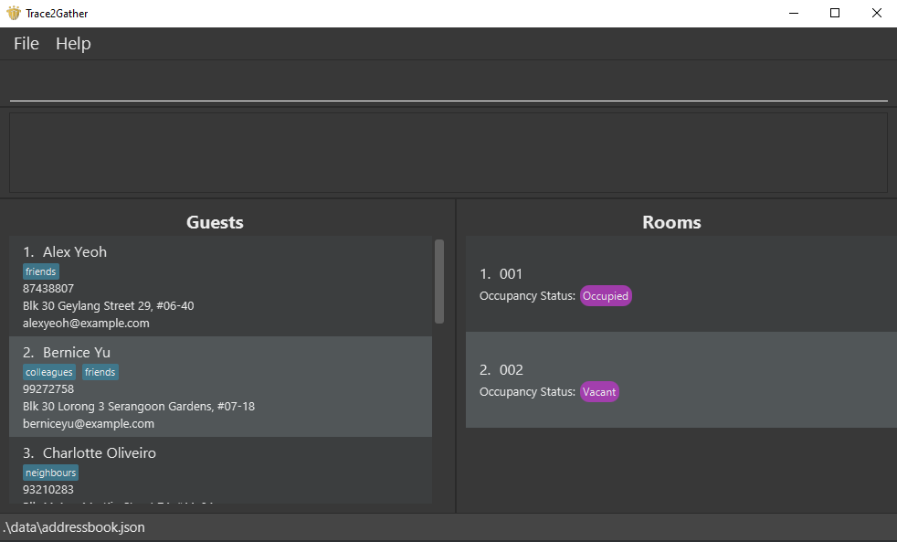

5. Type a command in the command box (shown in the screenshot below) and press Enter to execute it. For example, typing **`list guests`** and pressing Enter will show the UI below. 
   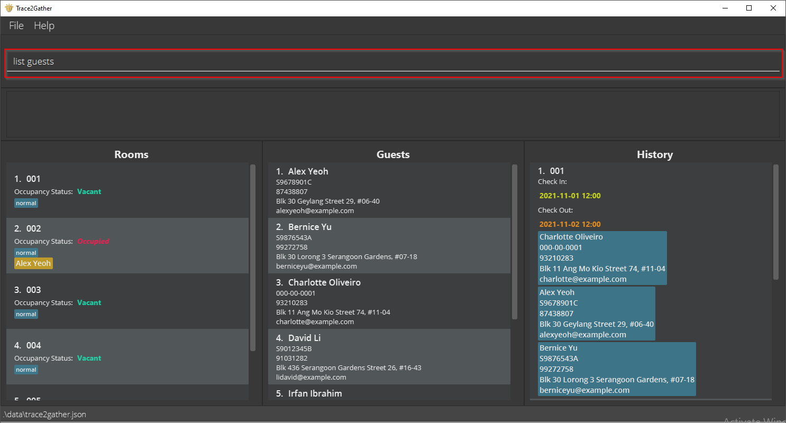
   Some example commands you can try are the following:

   * **`list guests`** : Lists all guests.

   * **`addroom 5 t/typeA`** : Adds 5 rooms of type A to the room list.

   * **`add n/John Doe p/98765432 e/johnd@example.com a/John street, block 123, #01-01 id/S98765432H`** : Adds a contact named `John Doe` to the Trace2Gather.

   * **`checkin 5 g/1`**: Checks in the 1st guest into the 5th room in the room list.

   * **`clear`** : Deletes all rooms, guests and past records.

   * **`exit`** : Exits the app.
    
    
6. Refer to the [Features](#features) section below for details of each command.

## Features
This section showcases all our application's features.
Each feature has its own sub-section, with formats and examples for clarity.

**:information_source: Notes about the command format:** 

* All commands are in lower case, e.g. add, record, guest, addroom, etc.

* Words in `UPPER_CASE` are the parameters to be supplied by the user. 
  For example: in `add n/NAME`, `NAME` is a parameter which can be used as `add n/John Doe`.

* Items in square brackets are optional. 
  For example: `n/NAME [t/TAG]` can be used as `n/John Doe t/Quarantine` or as `n/John Doe`.

* Items with `…`​ after them can be used multiple times including zero times. 
  For example: `[t/TAG]…​` can be used as `t/Quarantine`, `t/SeafoodAllergy`, etc.

* Parameters can be in any order. 
  For example: if the command specifies `n/NAME p/PHONE_NUMBER`, `p/PHONE_NUMBER n/NAME` is also acceptable.

* If a parameter is expected only once in the command, yet it is specified multiple times, only the last occurrence of the parameter will be taken. 
  For example: if you specify `p/12341234 p/56785678`, only `p/56785678` will be taken.

* Extraneous parameters for commands that do not take in parameters (such as `help`, `exit` and `clear`) will be ignored. 
  For example: if the command specifies `help 123`, it will be interpreted as `help`.

* If you have a smaller screen, please use the application in full screen mode, by clicking the square icon at the top right-hand corner of the window.

* For devices with smaller screens, some information about guests, rooms, or residencies may be cut off with an ellipses.

#### Viewing help : `help`

Shows a message explaining how to access the [help page](https://ay2122s1-cs2103t-t13-3.github.io/tp/UserGuide.html).

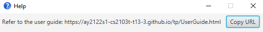

Format: `help`

### Guests

#### Adding a guest: `add`

Adds a guest to Trace2Gather.

Format: `add n/NAME p/PHONE_NUMBER e/EMAIL a/ADDRESS id/NRIC [t/TAG]…​`

Acceptable format for keywords: 
1. Names: No special characters, but spaces are allowed. No longer than 50 characters.
2. Phone Number: Digits only, and at least 3 digits long.
3. Email: Must follow the format of xxx@yyy.zzz.  
4. Address: Special characters like `#` are allowed for address purposes, must not be blank.
5. Id: Accommodates for international guests who may have longer identification numbers and/or special characters. It must not be an empty string, and it must be no longer than 50 characters. It is case-insensitive.
6. Tags: No whitespaces within a tag.

:bulb: **Tips:**  
1. A guest can have any number of tags (including 0).  
2. Two guests who have identical IDs are considered identical.

Examples:
* `add n/John Doe p/98765432 e/johnd@example.com a/John street, block 123, #01-01 id/S98765432G`
* `add n/Betsy Crowe t/Quarantine e/betsycrowe@example.com a/Crowe Lane id/S98765431G p/1234567 t/SeafoodAllergy`

#### Listing all guests : `list guests`

Shows a list of all guests in Trace2Gather. If you were searching for a guest earlier using the `guest` command, using `list guests` would yield you the full list of guests, and it would be displayed in the `Guests` panel. This is illustrated in the screenshot below after the execution of the `list guests` command. 

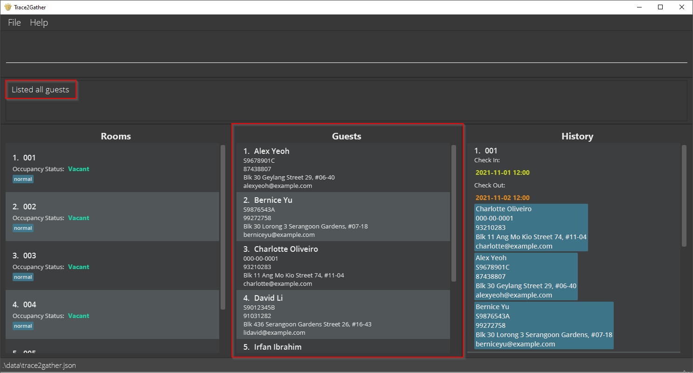

Format: `list guests`

#### Editing a guest : `edit`

Edits an existing guest in Trace2Gather.

Format: `edit INDEX [n/NAME] [p/PHONE] [e/EMAIL] [a/ADDRESS] [id/ID] [t/TAG]…​`
* Edits the guest at the specified `INDEX`. The index refers to the index number shown in the displayed guest list. The index **must be a positive integer** 1, 2, 3, …​
* At least one of the optional fields must be provided.
* Existing values will be updated to the input values.
* When editing tags, the existing tags of the guest will be removed, i.e. adding of tags is not cumulative.
* You can remove all the guest’s tags by typing `t/` without
  specifying any tags after it.

Acceptable format for keywords:
1. Names: No special characters, but spaces are allowed. No longer than 50 characters.
2. Phone Number: Digits only, and at least 3 digits long.
3. Email: Must follow the format of xxx@yyy.zzz.  
4. Address: Special characters like `#` are allowed for address purposes, must not be blank.
5. Id: Accommodates for international guests who may have longer identification numbers and/or special characters. Must not be an empty string, and there is a 50-character limit on the length.
6. Tags: No whitespaces within a tag.

Examples:
*  `edit 1 p/91234567 e/johndoe@example.com` Edits the phone number and email address of the 1st guest to be `91234567` and `johndoe@example.com` respectively.
*  `edit 2 n/Betsy Crower t/` Edits the name of the 2nd guest to be `Betsy Crower` and clears all existing tags.

#### Locating guests by name: `guest`

Find guests whose names contain any of the given keywords.

Format: `guest KEYWORD [MORE_KEYWORDS]`

* The search is case-insensitive. e.g. `hans` will match `Hans`
* The order of the keywords does not matter. e.g. `Hans Bo` will match `Bo Hans`.
* Only the name is searched.
* Guests matching at least one keyword will be returned (i.e. `OR` search).
  e.g. `Hans Bo` will return `Hans Gruber`, `Bo Yang`

:exclamation: **Caution:** 
    Only full words will be matched, e.g. `Han` will not match `Hans`.

Examples:
* `guest John` returns `john` and `John Doe`
* `guest alex david` returns `Alex Yeoh`, `David Li` 

The image below is an example of how part of the application interface may look when the command `guest alex david` is executed.
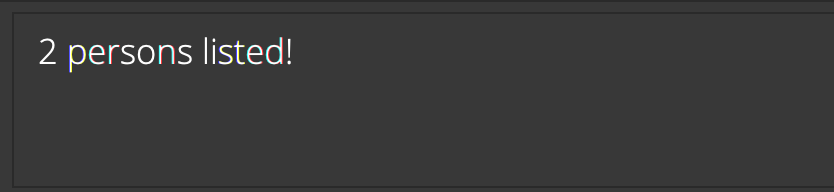
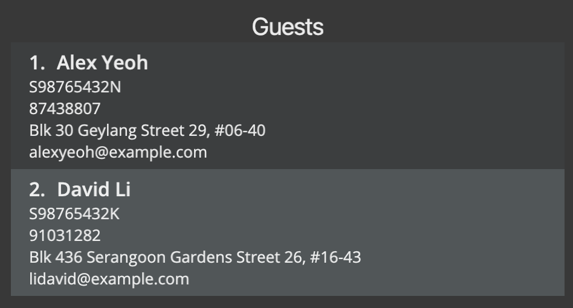

  

### Rooms

#### Adding rooms : `addroom`

Adds the specified number of rooms with the specified tag(s).

Format: `addroom NUMBER_OF_ROOMS t/tag [t/tag]...`

* Adds the specified `NUMBER_OF_ROOMS` of type `tag` to the end of the list of rooms.
* The specified number of rooms **must be a positive integer** 1, 2, 3, …​
* The full list of rooms will be shown after rooms have been added.
* Note: There should be no whitespace within a tag.

:bulb: **Tip:**
A room can have one or more tags.

:exclamation: **Caution:**
You can only add up to 999 rooms.

Examples:
* `addroom 5 t/typeA`
* `addroom 10 t/typeB t/reserved`

#### Checking into a room : `checkin`

Checks in a group of guests into a room. 

Format: `checkin ROOM_INDEX g/GUEST_INDEX [g/GUEST_INDEX]...`

:bulb: **Tips:**  
1. A room can have more than one guest. 
2. If you cannot check guests into a room, check that the room index and guest index(es) are the ones you can see on the panels. Otherwise, use the command `list rooms` and `list guests` to show all rooms and guests. 

:exclamation: **Caution:**  
1. You cannot check in the same guest to multiple rooms.  
2. Advanced users can edit the JSON such that a guest can be checked in and checked out at the same time, but this is not the intended use of the application.

The indices refer to the index numbers shown in the numbered guest/room list.

Examples:
* `checkin 5 g/1`
* `checkin 1 g/2`

The image below is an example of how part of the application interface looks when the command `checkin 3 g/2 g/3 g/6` is executed.
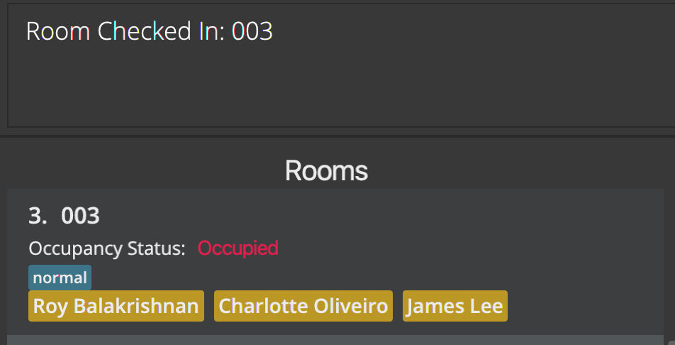

#### Checking out of a room : `checkout`

Checks out a group of guests from a room.

Format: `checkout ROOM_INDEX`

The room index refers to the index number shown in the displayed room list.

Example:
* `checkout 5`
* `checkout 7` 

The image below is an example of how part of the application interface looks when the command `checkout 4` is executed.
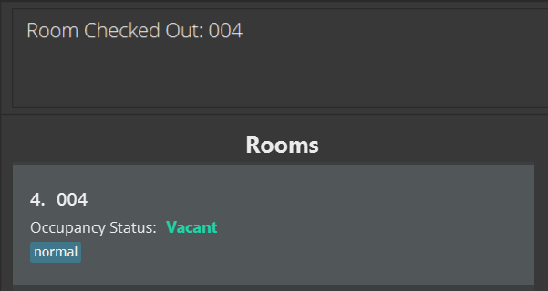

#### Locating a specific room : `room`

Shows a list of rooms that match the room numbers provided. Room numbers should have 3 digits.

Format: `room ROOM_NUMBER [MORE_ROOM_NUMBERS]`

Example:
* `room 005 010` 
* `room 003`

The image below is an example of how part of the application interface looks when the command `room 001 002` is executed.
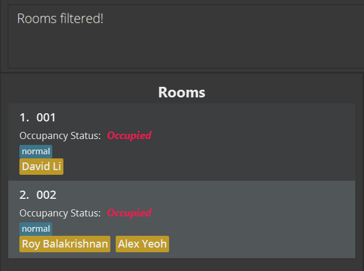

#### Listing all rooms : `list rooms`

Shows the list of all rooms in Trace2Gather. If you were searching for a room using the `room` command earlier, using `list rooms` would yield you the full list of rooms, and it would be displayed in the `Rooms` panel. This is illustrated in the screenshot below after the execution of the `list rooms` command. 

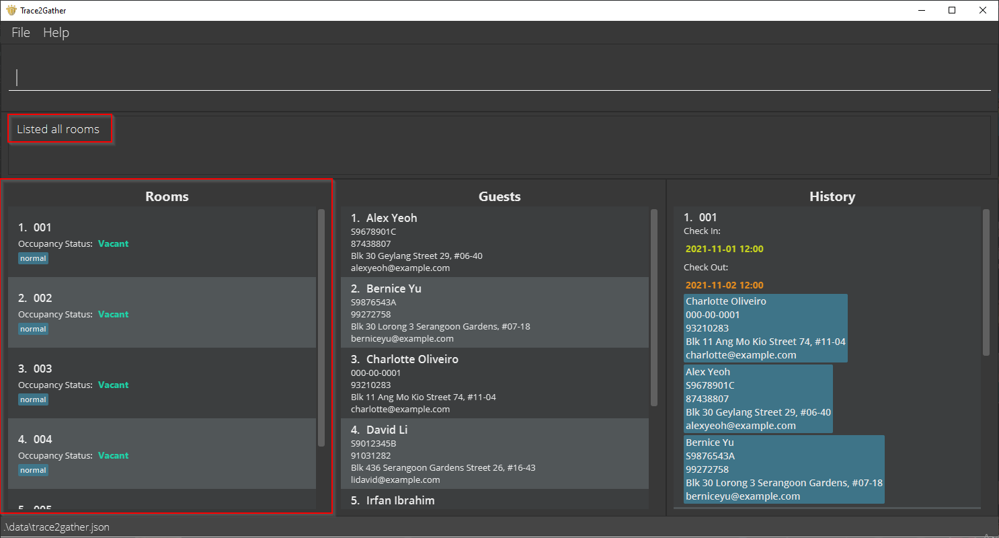

Format: `list rooms`

#### Listing all occupied rooms : `list rooms occupied`

Shows the list of all rooms that are occupied in Trace2Gather. The image below illustrates a possible example of what you could see after executing the command. Only Room 002 was occupied, so `list rooms occupied` returns only Room 002, leaving out the rest of the vacant rooms.

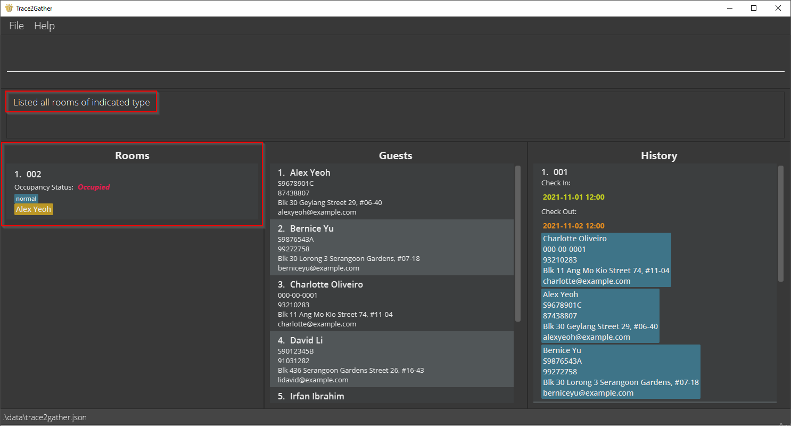

Format: `list rooms occupied`

#### Listing all vacant rooms : `list rooms vacant`

Shows the list of all rooms that are vacant in Trace2Gather. The image below illustrates a possible example of what you could see after executing the command. Room 002 was occupied, so `list rooms vacant` does not display Room 002, but displays all other vacant rooms.

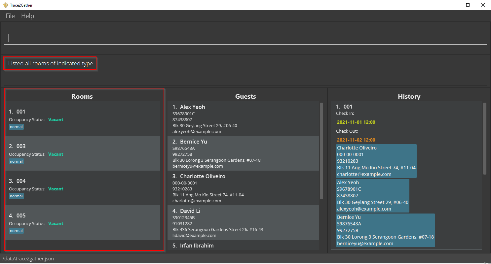

Format: `list rooms vacant`

### Records

#### Listing all records : `list records`

Shows the list of past residencies in Trace2Gather. If you were searching for a record earlier using the `record` command, using `list records` would yield you the full list of records, and it would be displayed in the `History` panel. This is illustrated in the screenshot below after the execution of the `list records` command. 

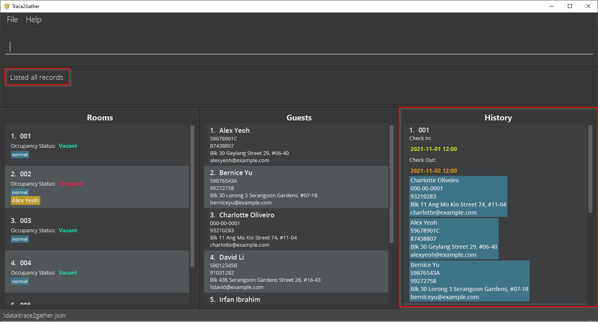

Format: `list records`

#### Locating specific records: `record`

Shows the records that match all the keywords provided. Case-insensitive, and at least 1 keyword must be entered. 

Format: `record KEYWORD [MORE KEYWORDS]... `

The following fields are what you can use to search for a record:
1. Guest Name
2. Guest Id
3. Guest Phone Number
4. Guest Address
5. Guest Email
6. Guest Tags
7. Room Number
8. Checkin Time
9. Checkout Time

Acceptable formats for keywords: 
1. Dates of stay: YYYY-MM-DD.
2. Names: No special characters, but spaces are allowed.
3. Room Numbers: must be in its 3-digit format, e.g. 001, 233, 999. 

Example:  
`record Alex` shows the residencies Alex had in the past. 
`record 001` shows the residencies Room 001 had in the past. 
`record Alex 001` shows the residencies that involve Alex staying in Room 001 in the past. 
`record Alex Bernice` shows the residencies Alex and Bernice had together in the past. 
`record 2021-10-31` shows the past residences that include the specified date (both checkin and checkout included).

### Database / Storage

#### Clearing all entries : `clear`

Clears all entries from Trace2Gather.

Format: `clear`

:exclamation: **Caution:**
Using this command will clear your JSON file, which means that all your room and guest objects will be erased.

#### Exiting the program : `exit`

Exits the program.

Format: `exit`

#### Saving the data

Trace2Gather data is saved in the hard disk automatically after any command that changes the data is executed. There is no need to save manually.

#### Editing the data file

Trace2Gather data is saved as a JSON file `[JAR file location]/data/trace2gather.json`. Advanced users are welcome to update the data directly by editing the JSON file.

:exclamation: **Caution:**
If your changes to the JSON file causes the data within the file to be invalid, Trace2Gather will discard all the data in the JSON file and start with an empty data file at the next run.

## Frequently Asked Questions (FAQ)
We understand that you might have questions regarding our application. Below are some common questions we have been asked.

**Q**: How do I transfer my data to another Computer? 
**A**: Install the app in the other computer and overwrite the empty data file it creates with the file that contains the data of your previous Trace2Gather home folder.

**Q**: Why does my edit/checkin/checkout command not work? 
**A**: The indices required by these commands are the ones from the numbered list seen in the GUI. You can try using one or more of the `list` commands to show all available data and make sure you have the correct indices. 

## Command Summary

Action | Format, Examples
--------|------------------
**Add** | `add n/NAME p/PHONE_NUMBER e/EMAIL a/ADDRESS id/ID [t/TAG]…​`   e.g., `add n/James Ho p/22224444 e/jamesho@example.com a/123, Clementi Rd, 1234665 nric/S9943233F t/friend t/colleague`
**Addroom** | `addroom NUMBER_OF_ROOMS t/tag [t/tag]...`  e.g., `addroom 5 t/typeA`
**Clear** | `clear`
**Checkin** | `checkin ROOM_INDEX g/GUEST_INDEX [g/GUEST_INDEX]...`  e.g., `checkin 5 g/1`
**Checkout** | `checkout ROOM_INDEX`  e.g., `checkout 4`
**Edit** | `edit INDEX [n/NAME] [p/PHONE_NUMBER] [e/EMAIL] [a/ADDRESS] [id/ID] [t/TAG]…​`  e.g.,`edit 2 n/James Lee e/jameslee@example.com`
**Exit** | `exit`
**Guest** | `guest KEYWORD [MORE_KEYWORDS]`  e.g., `guest James Jake`
**List** | `list guests`, `list records`, `list rooms`, `list rooms occupied`, `list rooms vacant`
**Help** | `help`
**Record** | `record KEYWORD_ONE...`  e.g., `record Alex`, `record 001`
**Room** | `room ROOM_NUMBER [MORE_ROOM_NUMBERS]`  e.g., `room 001 002`
